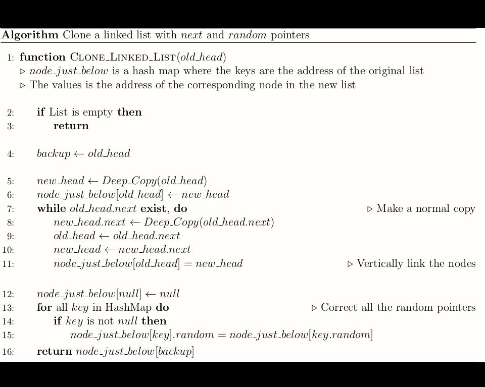

  

  

**A strange game. The only winning move is not to play**.

# Introduction
This repository contains the pseudo-code of various algorithms and data structures necessary for **Interview Preparation** and **Competitive Coding**. The pseudocodes are written such that they can be easily adapted to any language. Let us remove the clutter of language and focus on the core concepts of the question!

# Sample GIF

# Contribution
Read this section carefully if you are planning on contributing to this repository. 

**The What**

* In the `Pseudocode` folder, you can find a lot of algorithms. If you've come across any interesting algorithms that changed the way you think about any topic, please consider contributing it to this repo.

* There are a lot of pseudocodes with no explanation. If you want to write a detailed explanation on the workings and intuition of these algorithms, please raise an issue and start working on it after it is approved). I would prefer if the explanation is in `pdf` format. However, markdown format is equally acceptable.

* If you are familiar with `tikz`, `pgf` or `beamer`, consider making some animations/graphs/diagrams/plots to explain the various algorithms.

* If you want to contribute anything other than pseudocodes, feel free to explore the repository and pick up a code and explain its logic and working (either in `pdf` or `Markdown` format).  If you don't see your desired code, feel free to add it. However, remember that this repository is not a code dump and you should only add new codes if you have written a good post explaining the intricacies of the algorithm.

**The Why**

* You'll understand the algorithm in depth once you start working on its pseudocode because now you need to explain your code to people who code in a variety of languages. 

* Your work might help other people preparing for interviews/competitive programming get acquainted with the core concepts of the algorithms rather than being confused by the clutter of the programming language.

* Lastly, you'll get to learn **LaTeX** which is a great experience in itself. 

**The How**

* If this is your first time contributing to a public repository, please refer to this [link](https://akrabat.com/the-beginners-guide-to-contributing-to-a-github-project/). For more clarity, you can refer to this [link](https://github.com/MarcDiethelm/contributing).

* If you are not familiar with **TeX** or TypeSetting in general, please refer to this [link](https://www.overleaf.com/learn/latex/Learn_LaTeX_in_30_minutes). You don't need to install anything to contribute to this repository. Just make sure that you have an **Overleaf** account and you are good to go.

* Create an _issue_ if you've decided to work on an algorithm and get it approved before the coding phase. **Please do not start working on the issue before commenting on that particular thread.**

* Make sure to follow the coding standards. Put the source code in a file called `SourceCode.tex`. (Notice the Capitalisation).

* If you want to code a different implementation than what is already present (for example, _iterative_ instead of _recursive_, constant space instead of linear space, etc), please create a new sub-folder inside the root directory.

* Don't include a lot of comments in the pseudocode (it just means that the code is not self-expressive). However, if the algorithm is highly non-trivial and you would like to include some explanation, please do so before or after the pseudocode. Refer to this [link](Pseudocode/Heaps/Median%20in%20a%20Stream%20of%20Integers/Median%20in%20Stream.pdf) for example. 

* Do **not** create a **ReadMe** file inside the newly created folder. If you want to submit the code with which you tested your pseudocode, you can add it in the **Validation Codes** folder following the same hierarchy.

* If you borrow the code from any online/offline source, please remember to cite it.

* Finally, **please do not include a `pdf` file of the final source code** (This is to avoid untracked binary in the repo's history). The pdf files would be generated after everything has been finalized.

* Make a pull request. Sit back and relax while your pull request gets merged.

**Stuck?**
  * If you need any clarifications or are stuck on something for a long time, feel free to ping us. 

# Credits
Icon made by [Freepik](https://www.flaticon.com/authors/freepik) from [Flaticon](https://www.flaticon.com)
